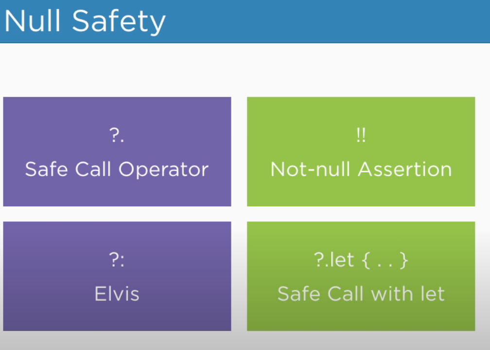

# Kotlin

- [Kotlin Tutorial](https://youtu.be/G6oVG5XetnE?list=PLlxmoA0rQ-LwgK1JsnMsakYNACYGa1cjR)
- Language Tutorial: [Learn Kotlin in 12 Minutes - 2021](https://youtu.be/iYrgWO2oibY)
- [Kotlin Tutorial For Beginners [Full Course] Learn Kotlin For Android Developments](https://youtu.be/SXLmr4Qp4OM)

## [How Kotlin works in android](https://stackoverflow.com/questions/47153013/how-does-kotlin-code-get-executed-in-an-android-application-and-how-is-it-diffe)

- Kotlin compiler takes Kotlin code and emites JVM byte code in `.class` files
- Android gradle plugin takes the JVM bytecode and converts it into Dalvik bytecode and packes it into .apk
- When the `.apk` file is installed on device ART converts Dalvik bytecode and converts that into machine code
- The machine code is executed

## Open Kotlin project in intellij

- Create new project
- Select Kotlin from left navigation
- Select Kotlin JVM from middle-top section

## type inference

- Kotlin infers type at compile time & it gets fixed

## can be null

- kotlin doesn't allow null

```
val i: Int = null // not ok
val i: Int? = null // not ok
```

## Variable

- every variable must have a type (statically type)
- val will allow assignment once
- `val` : readonly, can't point to other
- `var` : read & write permission, can be changed

```
val firstname: String = "Rahul"
var weight = 1232
weight = 12 // ok
firstname = "A" // not ok

```

## list

- `mutableListOf` - mutable list (can add)
- `listOf` - immutable list (can't add)

```
val imperials = listOf<String>("Emperor", "Darth Vader", "Tarkin")
println(imperials.sorted()) // [Darth Vader, Emperor, Tarkin]
println(imperials[2]) // Tarkin
println(imperials.contains("Emperor")) // true

for(imperial in imperials) {
    println(imperial)
}
```

```
val imperials = mutableListOf<String>("Emperor", "Darth Vader", "Tarkin")
println(imperials.sorted()) // [Darth Vader, Emperor, Tarkin]
println(imperials[2]) // Tarkin
println(imperials.contains("Emperor")) // true

for(imperial in imperials) {
    println(imperial)
}

imperials.add(0, "Snoke")
println(imperials.size) // 4
println(imperials.indexOf("Tarkin")) // 3

imperials.remove("Tarkin")
```

## hashmap

```
val rebelVehicles = hashMapOf<String, String>("Solo" to "Millenium Falcon" , "Boba" to "Rocket Pack")

println(rebelVehicles.get("Solo"))
println(rebelVehicles["Solo"])
println(rebelVehicles.getOrDefault("Luke", "This shop doesn't exist"))
rebelVehicles["Luke"] = "XWing"
println(rebelVehicles.values)
rebelVehicles.remove("Boba")
```

## loop

```
val persons = listOf<String>("Farhan", "Tanvir", "Utshaw")
for(person in persons) {
    println("Name $person")
}

val marksheet = hashMapOf<String, Int>("Farhan" to 100, "Tanvir" to 200, "Utshaw" to 300)
for((key, value) in marksheet) {
    println("$key -> $value")
}
```

## for loop

```

for(i in 1..5) {
println(i)
}

```

## function

```

fun foo(name: String): Int {
print("Hello $name")
return 100
}

```



## `?.` safe-call operator

- stops execution of the method if called on null object, returns null in that case

```

var sampleString: String? = "This is a sample string"
println(sampleString) // This is a sample string
sampleString = null

println(sampleString?.length) // null

println(sampleString?.length == null) // true


val len = sampleString?.length ?: -1
println(len) // -1


```

## safe call with let

- execte a block of code ONLY IF the object is not null

```
var someObject: String? = "This is some String"
//    someObject = null
someObject?.let {
    print("This will be exected ONLY IF the obejct is not null")
}

```

## `?:` elvis operator

```
val immutableCar: Car = car ?: Car("Porche")
```

- The immutableCar can be either the same as the car or a Porche if the car is
  null.

## variable type

```

val doubleNum : Double = 12.33
val floatNum : Float = 12.33f
val longNum : Long = 12233L
val aDouble = doubleNum.toString()

```

## multiline string

```

val rawCrawl = """
This is some long long
newline sentence
""".trimIndent()

```

## string equality

```

println(person.contentEquals("Farhan Tanvird"))

```

## string contains

```

println(person.contains("Tanvir"))

```

## string contains ignore case

```

println(person.contains("Tanvir", true))

```

## toString()

```

val intNum : Int = 12
val strNum : String = intNum.toString()
println(strNum)

```

## inline calculation

```

fun calculateNumberOfGoodGuys(teamA: Int, teamB: Int) : Int {
return teamA + teamB
}
fun main() {

    print("Enemy team faced off agains ${calculateNumberOfGoodGuys(150, 10)} revel scum")

}

```

## when

```

val x: Int = 1

when(x) {
1-> print("x is 1")
2-> print("x is 2")
else -> print("x is not equal 1 or 2")
}

```

## OOP

```
open class Car constructor(private val make: String, private val model: String) {
    override fun toString(): String {
        return "Car(make='$make', model='$model')"
    }
    fun accelerate() {
        println("Vroom vroom....")
    }
    open fun details() {
        println("Car made by $make in $model")
    }
}

class Truck constructor(private val make: String, private val model: String, private val towinCapacity: Int) : Car(make, model) {
    fun tow() {
        println("taking the horses to the rodeo")
    }
    override fun details() {
        super.details() // calling the parent class fun
        println("Truck made by $make in $model with towing capacity $towinCapacity")
    }
}

fun main() {
    val car =  Car("Toyota", "2021")
    val truck = Truck("Ford", "1992", 2300)
    println(truck)
    truck.accelerate()
}

```
